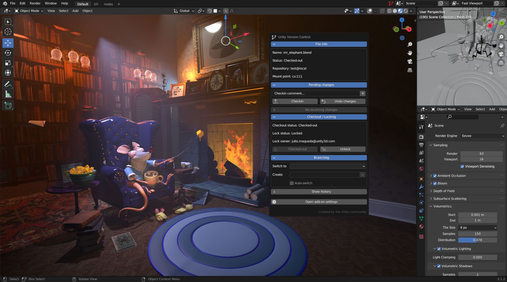

# Unity Version Control add-on for Blender

Powered by Unity, [Version Control](https://unity.com/solutions/version-control) is a top-notch [version control system](https://unity.com/solutions/what-is-version-control) specially designed for game developers and artists.

This add-on integrates the essentials of Unity Version Control into Blender, letting you keep track of your changes without leaving your workspace.

## Requirements

* [Blender](https://www.blender.org/download/) >= 2.8.0 (tested up to 3.6.5 LTS)
* [Unity Version Control](https://www.plasticscm.com/download) >= 11.0.16.8101

> ℹ️ &nbsp; The add-on will use your local configuration of Unity Version Control automatically, no matter if you connect to an on-premise server or if you have a [cloud subscription](https://service-store.unity.com/order) _(**first 3 seats and 5 GB are free**)_.

## Installation

You can find the latest version of the add-on in the [releases](https://github.com/juliomaqueda/blender-uvcs/releases) page.

Open Blender preferences and jump to the Add-ons section. You should see a button reading `Install...` in the upper right corner. Simply choose the zip file you downloaded and click `Install Add-on`.

> ℹ️ &nbsp; By default, add-ons in Blender are opt-in modules, so you would need to enable the add-on manually.
>
> 

### Upgrade

In case you have an older version of the add-on installed, you may want to deactivate and remove the old version from the Add-ons section. After that, it is strongly recommended to restart Blender before [installing the new version](#installation).

## Getting Started

When the [blender-uvcs](https://github.com/juliomaqueda/blender-uvcs) add-on is enabled, it will automatically detect if the current file belongs to a Unity Version Control workspace. If so, a new icon () will show up in the toolbar to access Unity Version Control [features](#features).

A special effort has been made to achieve user friendly interfaces. You will see tooltips around for almost all components, as well as information messages for operations. In case an invalid operation is attempted, you will be prompted with the process log to facilitate triage.

## Features

### File information

Quick glance at the add-on panel and you will be instantly informed about...
- The status of the file (private, cheched-out, no changes)
- Current branch
- Repository
- Server

### Add private files to source control

Decide _when_ you want your new (private) files to be under source control.

### Checkin your changes

Whenever you have local changes to push, the Checkin section is there to help. And even though multiline properties are still a missing feature in Blender, the add-on covers them with dynamic inputs.

### Undo your changes

Restore the remote version whenever you need it.

### Incoming changes and update

Whenever new changesets are available in your branch, the plugin will inform you. In addition, you will be able to see all details about the incoming changes and update to the latest version.

### Checkout files

Checking out files is the way to tell the Unity Version Control server your intention to edit a file. While not that common for text files, it is a powerful feature for binaries, where merge tools lack utility.

### Lock / unlock

Depending on the server configuration, your checkout operations may entail exclusive locks.

This functionality empowers you to effortlessly manage file locks, providing real-time updates on the lock status, if applicable.

### Create new branches

Want to try new ideas without leaving the changes in local or messing up your working branch? Create new branches and keep your work save. This feature also allows you to create **child branches** and **switch** to the new branches automatically.

### Switch between branches

Point your local workspace to a different branch at any time.

### Walk through the history

Explore when, why, and by whom a file was modified during its lifetime.

### Add-on preferences

In case you have different installations of Unity Version Control on your local machine, you can configure the specific `cm` client to be used by the add-on.

## Roadmap

There are many features I would like to include in the add-on, having as immediate elements:
- Checkin changes to a new branch
- Detecting moved files
- Creating labels
- Showing extra info when the workspace has pending changes
- Shelving

## Changelog

Changes are tracked in the [releases](https://github.com/juliomaqueda/blender-uvcs/releases) page.

## Contributing

### Found any bugs? Got questions or ideas?

I do not consider myself an expert in either Blender or python, so I will appreciate your feedback.

Just rise a ticket [here](https://github.com/juliomaqueda/blender-uvcs/issues)!

### Support

If you like this project and want to support my work, feel free to [buy me a coffee](https://ko-fi.com/juliomaqueda) :)

## Copyright

Copyright (c) 2023 [Julio Maqueda](https://github.com/juliomaqueda)
